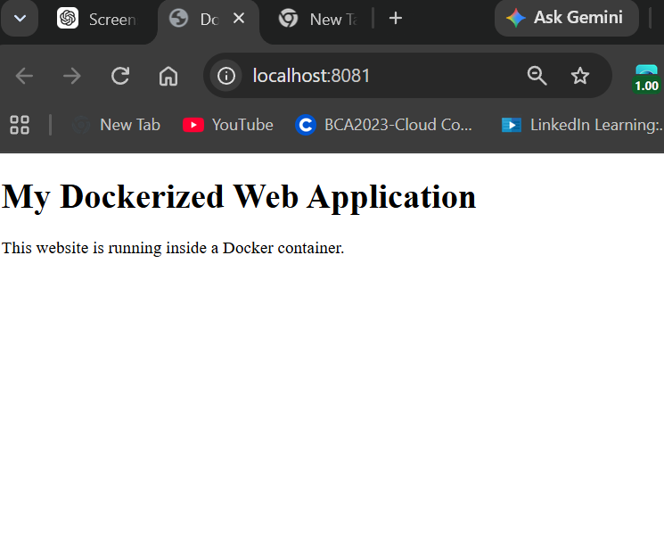
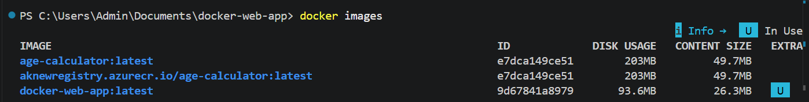
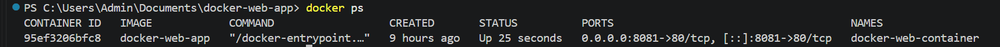

# Dockerized Web Application

## Project Overview

A simple static web application packaged and deployed using Docker.

## Objective

The objective of this project is to understand Docker fundamentals by containerizing a static website and running it inside a Docker container.

## Technologies Used

* HTML
* Docker
* Dockerfile
* Nginx
* Git
* GitHub

## Project Structure

```text
docker-web-app
│
├── screenshots
│   ├── 01_docker_container_website.png
│   ├── 02_docker_image.png
│   └── 03_docker_container.png
│
├── index.html
├── Dockerfile
└── README.md
```

## Dockerfile

The Dockerfile uses the lightweight Nginx Alpine image to serve the static website.

```dockerfile
FROM nginx:alpine

COPY index.html /usr/share/nginx/html/index.html

EXPOSE 80
```

## Docker Commands Used

### Build Docker Image

```bash
docker build -t docker-web-app .
```

### Run Docker Container

```bash
docker run -d -p 8081:80 --name docker-web-container docker-web-app
```

### Check Running Containers

```bash
docker ps
```

## Application Access

The website runs locally at:

```text
http://localhost:8081
```

## Deployment Process

1. Created a static HTML website.
2. Created a Dockerfile.
3. Built a Docker image using Docker.
4. Created and started a Docker container.
5. Mapped port `8081` on the host to port `80` in the container.
6. Accessed the website through `localhost:8081`.
7. Uploaded the project to GitHub.

## Screenshots

### 1. Dockerized Website



### 2. Docker Image



### 3. Running Docker Container



## Project Outcome

Successfully containerized a static website using Docker and served it through an Nginx web server running inside a Docker container.
